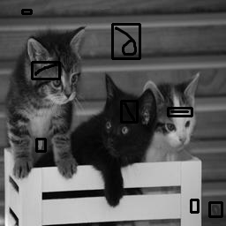
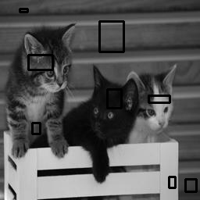
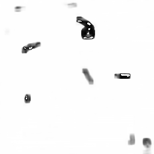

**Image Difference Detection**

- A simple _python_ script that applies the well-known method in Computer Vision "_**Structural Similarity Index**_"

- For more detail about this method refer to **[Wang's paper]** that first introduced this method in 2004
 
- Requirements To run:
    1. **python** 3
    2. **openCV**
    3. **scikit-image**
    4. **imutils**

- #### **Sample Results:**

  #### **original image**
         
    
  #### **Modified image**
  
    
  #### Difference between the two images
  
          
[Wang's paper]: <https://ece.uwaterloo.ca/~z70wang/publications/ssim.pdf>  